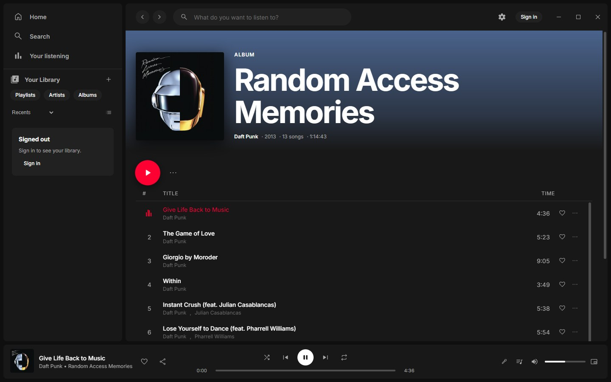
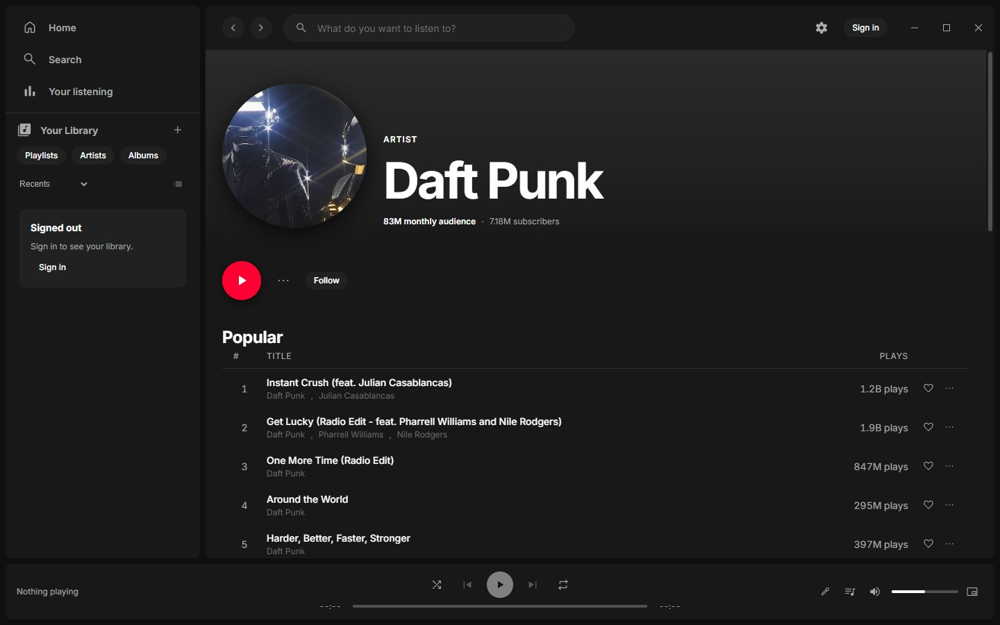
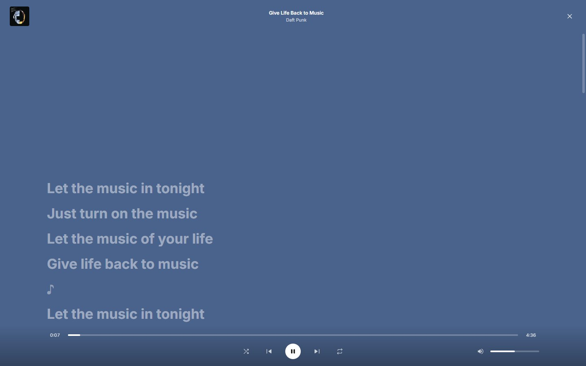
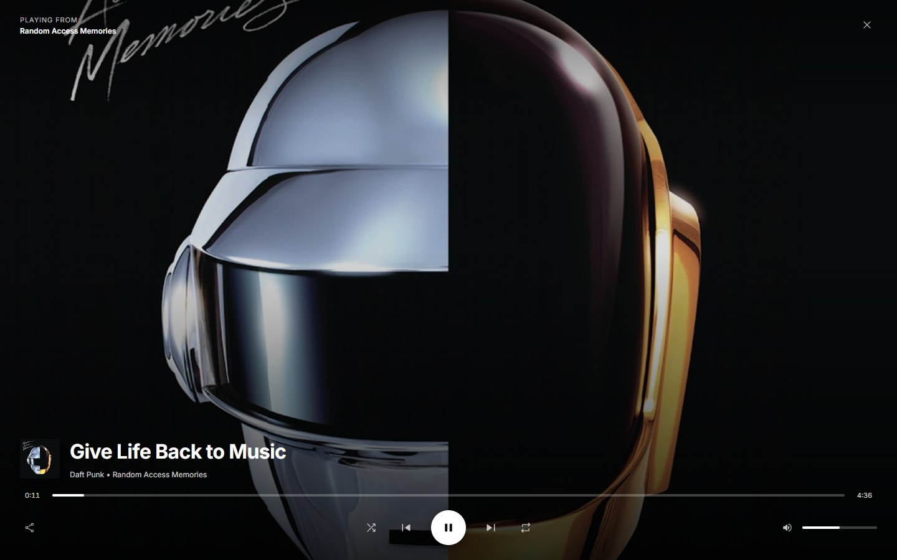

# Youtube Music Spotified

A desktop client that plays YouTube Music through a Spotify-style interface,
with Windows installers and native macOS source builds.

[](https://github.com/DarkSavci/youtube-music-spotified/releases/latest)
[](https://github.com/DarkSavci/youtube-music-spotified/actions/workflows/release.yml)
[](LICENSE)



Sign in with your YouTube Music account to get your library, likes and
playlists in Spotify's layout, with its shortcuts and now-playing view.

Unofficial personal project. Not affiliated with Spotify or YouTube.

## Download

Get the Windows installer from the
[latest release](https://github.com/DarkSavci/youtube-music-spotified/releases/latest).
The app then updates itself.

The installer is not code-signed, so Windows SmartScreen warns on first run:
choose **More info → Run anyway**.

On macOS, [build the app locally](#macos). Public signed Mac releases and
automatic Mac app updates are not provided.

## Features

- **Spotify's layout:** library sidebar, album and artist pages, queue, full-screen now playing
- **Premium audio quality** for YouTube Music Premium accounts, through a bundled [yt-dlp](https://github.com/yt-dlp/yt-dlp)
- **Timed lyrics** that follow the song
- **Crossfade, equaliser and volume normalisation**
- **Your listening:** stats built from your own play history
- **Resume where you left off**, even after a restart
- **Mini player, tray controls and media keys**; closing the window keeps the music playing
- **Automatic updates** from GitHub releases on Windows

## Screenshots

| Artist | Lyrics |
| --- | --- |
|  |  |



## Build from source

Requires [Go](https://go.dev) 1.26+ and [Node.js](https://nodejs.org) 22.12+.

### Windows

```bash
cd ui && npm install
cd ../desktop && npm install
npm run installer
```

This writes the installer to
`dist-installer/Youtube-Music-Spotified-Setup-<version>.exe`, and the unpacked
app to `dist-desktop/`. For the app folder alone, run `node build.js` instead.

The build downloads the latest yt-dlp and checks it against the release's
checksum. The app then keeps yt-dlp up to date on its own.

### macOS

Build on the Mac architecture you want to run: Apple Silicon (`arm64`) or
Intel (`x64`). Install Go, Node.js, and Apple's Command Line Tools
(`xcode-select --install`) first. macOS 12 is the toolchain's baseline;
older macOS versions are unsupported. CI checks macOS 15 on both architectures.

From the repository root:

```bash
npm ci --prefix ui
npm ci --prefix desktop
npm run package --prefix desktop
```

The output is
`dist-desktop/Youtube Music Spotified-darwin-<arch>/Youtube Music Spotified.app`.
Open it in Finder or copy it to Applications. The build includes the Go service,
yt-dlp, and Deno, so the resulting app does not need these tools on PATH.
Local ad-hoc signing is automatic and requires no Apple Developer account.
This is a locally built app, not a notarized download intended for redistribution.

To sign in, install Chrome, Edge, Brave, or Chromium in `/Applications` or
`~/Applications`. The app opens an isolated browser profile. Complete Google
sign-in there, return to the app, and choose **Finish sign-in**. Your regular
browser profile is not read or modified. Safari is not supported for this flow.

The close button hides the window while **Close to menu bar** is enabled;
click the Dock icon to reopen it. **Command-Q** quits and stops the Go service.
With that setting disabled, closing the main window also quits. The mini player,
menu-bar controls, and Media Session integration are available on Mac.

Mac app updates are manual: pull the latest source and rebuild. To also refresh
the bundled playback tools immediately, run:

```bash
npm run package --prefix desktop -- --refresh-tools
```

yt-dlp and Deno downloads are checksum-verified. Mac builds refresh their
cached copies after a week and a month respectively; there is no runtime
yt-dlp updater on Mac yet. If YouTube changes break playback, refresh and
rebuild. Account data and settings remain in
`~/Library/Application Support/Spotifier` when replacing the app.

### Run in development

Run a package build once to prepare the UI and bundled playback tools. Then:

```bash
go build -o bin/spotifier.exe ./cmd/spotifier
cd ui && npm run dev        # leave running
cd desktop && npm start     # in a second terminal
```

On macOS, use `go build -o bin/spotifier ./cmd/spotifier` instead. `npm start`
uses the Vite server if running, or the built UI otherwise.

### Test

```bash
go test ./...
npm test --prefix desktop
npm run typecheck --prefix ui
# After a package build:
node desktop/test/package-smoke.js
```

### Screenshots

```bash
cd desktop && node build.js && npx electron readme-shots.js
```

The app is captured signed out, so no account data ends up in them.

## Releasing

Bump `version` in `desktop/package.json` and push to `master`, or run the
**Release** workflow from the Actions tab, which bumps the version for you.
GitHub Actions builds the Windows installer and publishes the release, and installed
copies update to it.

## License

[MIT](LICENSE)

### Saved accounts and YouTube channels

Open **Settings → Accounts and channels** to add a Google account, use a saved account, or select a YouTube channel under the active account. A Google account's personal channel and its other YouTube channels can have different libraries; choose the channel you normally use on YouTube Music. Channel discovery requires an internet connection.

Each added Google login uses its own app-owned browser session. Account and channel selection survives relaunches. Switching stops playback and restarts the local service; each identity keeps its own queue, local listening history, and pending play reports. Device preferences remain shared. Existing installations retain their original session and personal-channel history without moving the database.

**Remove account** signs that saved Google session out of the app while keeping the other saved accounts. Local history is retained on disk. If a saved session expires, remove it and add the account again. Delegated channel-manager roles requiring Google's additional confirmation flow are not currently listed.
